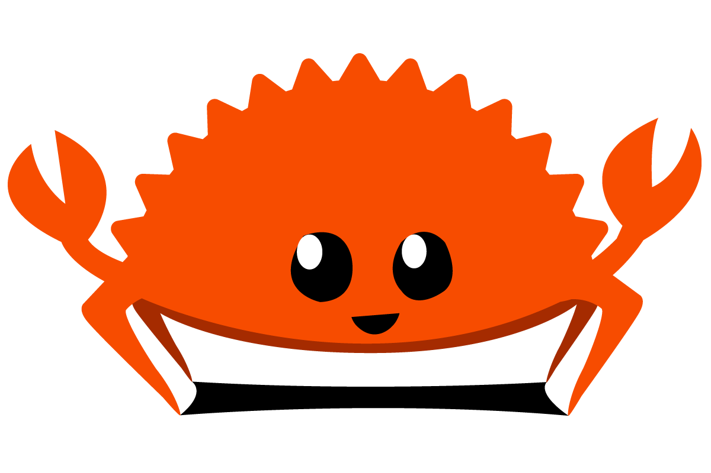
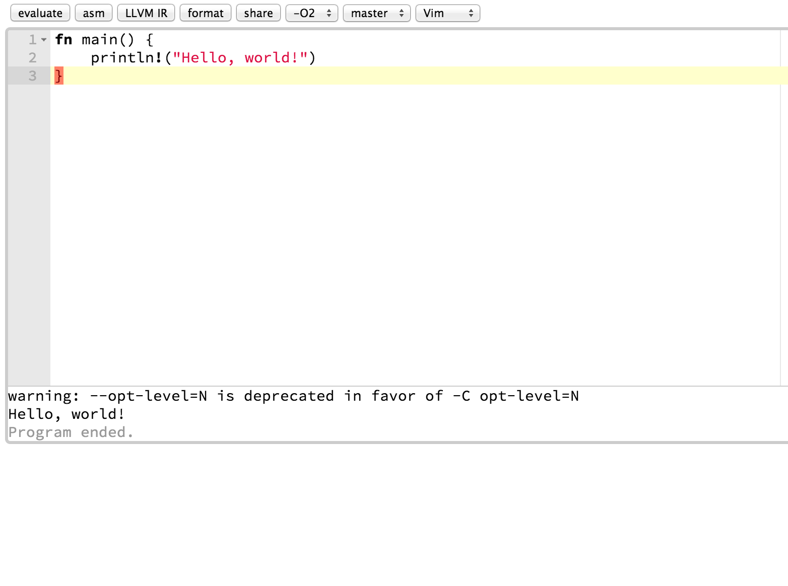
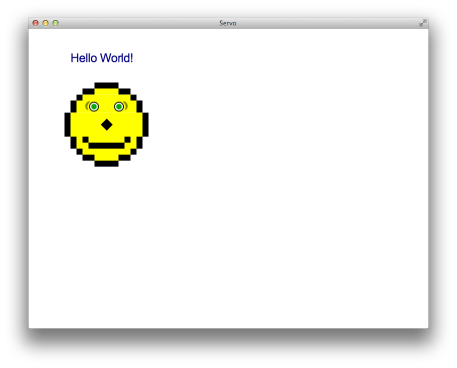
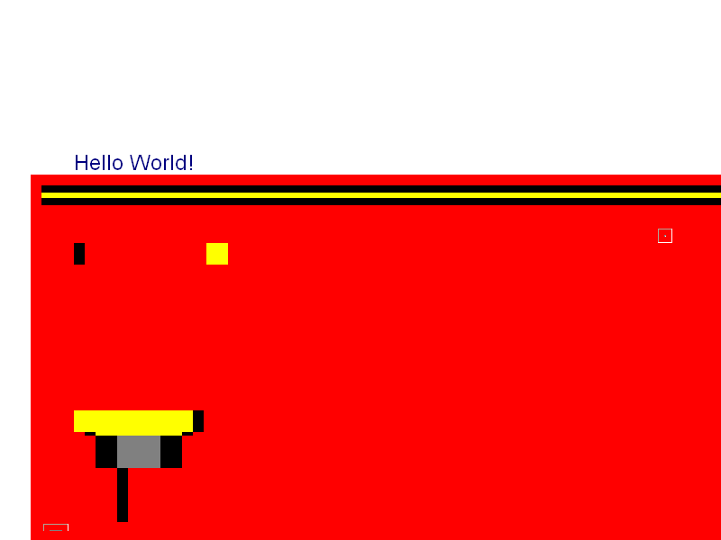
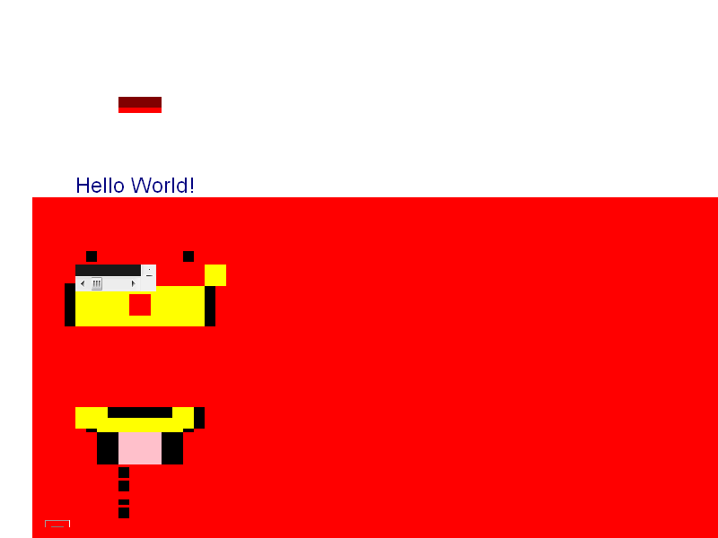
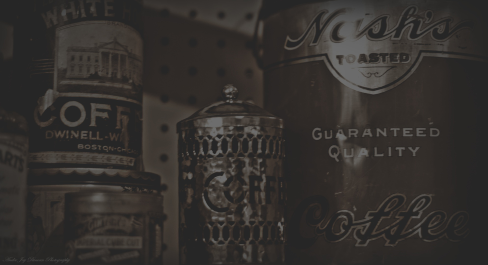
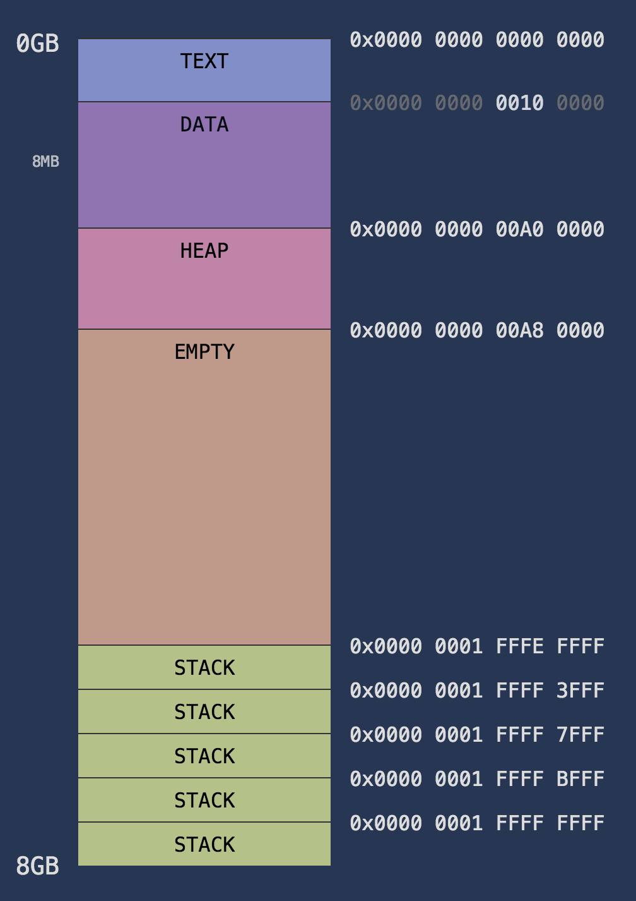
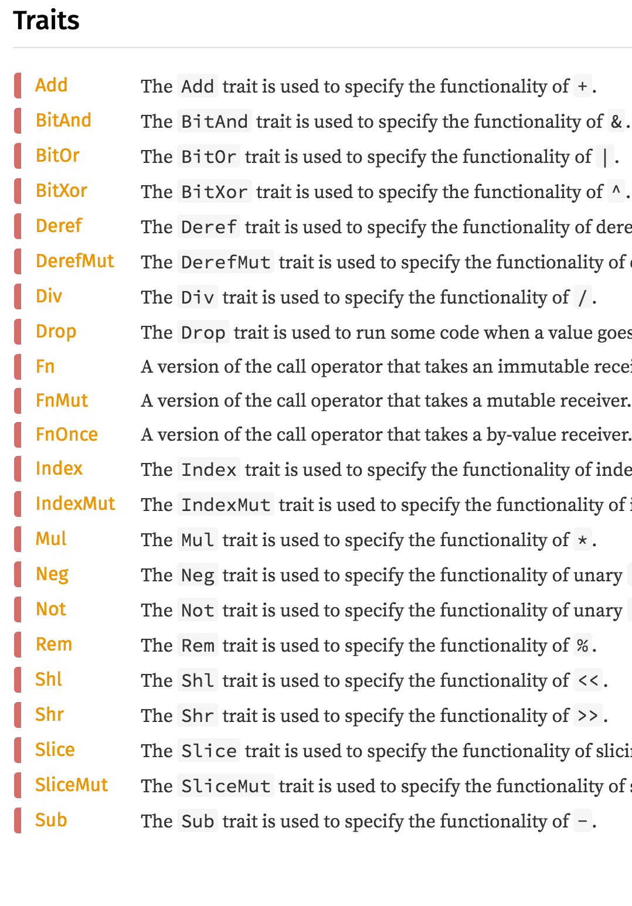
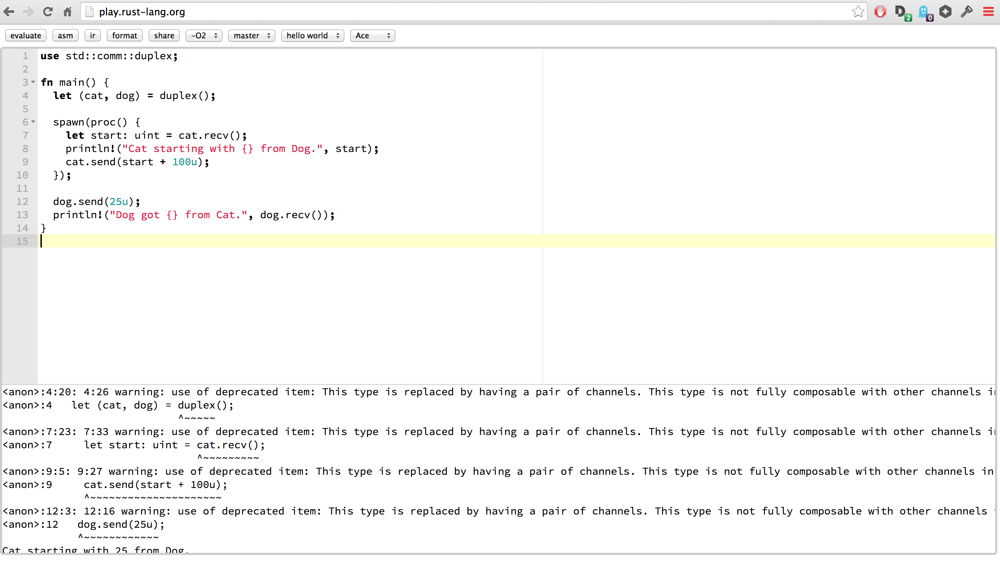

# [fit] Rust
# or: How I Learned to Stop Worrying and Love the Compiler

Alex Burkhart | @saterus | Neo Innovation


^
- consultant at Neo Innovation in Columbus
- Rich Web Applications, Rails, Ember
- we all wear a lot of hats
- dba, devops, architect, ux designer
- Dabbler, love to learn

---


^
- i also love to teach
- best teaching is sharing
- Which brings us to Rust
- share my enthusiasm for Rust with you
- get excited, learn new stuff, profit

---

# [fit] Rust =
# [*C++*, *Haskell*, *Ruby*].max()


^
- My pitch
- best of these
- "Rust keeps the C abstract machine model but innovates on the language interface."
- Good Decisions being made, imo.
- many very smart people, with a wide variety of backgrounds
- so are you, so apologies if i go too slow

---


^
- 1.0.0-alpha is being released this friday
- exciting week: soul-crushing amount of breaking changes this week
- astonishing amount of work being done
- best run project i've ever seen
- most libraries have been mostly-broken for the last 2-3 weeks
- this would have been the best workshop to run 2-3 weeks from now

---

#[fit] Installfest

The Rust Compiler is ~100mb

Latest Nightlies, not 0.12 release

## 1. https://www.sharedrop.io/
## 2. Flash Drives
## 3. http://www.rust-lang.org/


^
- need a text editor, terminal, and the Rust compiler
- flash drives of binaries for different architectures
- 2015-01-05 nightly build -> many changes from new years, fewer bugs
- 2015-01-06-7 might work, danger will robinson
- let's do a little bit of install now as people drift in

---


^
- 36,000 commits
- site that tracks breaking changes being committed

---




^
- Rustaceans won out over Rustorian
- need to add a monacle to the crab

---

#[fit] play.rust-lang.org



^
- web sandbox!
- all is not lost if you can't get a compiler...don't leave!
- have i mentioned that the community here is amazing enough yet?
- complete with vim/emacs modes!
- documentation examples link to live, runnable code!

---

# Columbus Rust Society

### meetup.com/columbus-rs/


^
- shameless plug
- things will start getting interesting
- enough preface, let's go

---

> "The goal is to design and implement a safe, concurrent, practical, static systems language."
-- Rust Project FAQ

^
- Use recent computer science research.
- Not to a Haskell-level though.
- Ruby's GC was invented in the 60's.
- Learn from some of our mistakes as an industry
- Let's examine some of these goals

---

# [fit] Safe
# Prevent the Preventable

Security Errors

Programmer Induced Instability

^
- Buffer Overflows
- UndefinedMethodError
- IndexOutOfBoundsError
- null pointer -> crash
- double frees -> crash
- never freed memory -> memory leak -> OOM
- dangling/wild pointers -> undefined behavior

---

# [fit] Practical
### ~~**Worse is Better**~~ Better is Good Enough

Explicit > Implicit

Not Built in a Vacuum

Modern High & Low Level Design

^
- Learn from Haskell's mistakes
- explicitly show costs
- c fast: cpu bound
- c is an amazing existing ecosystem
- amazing tools built already
- api design & testing capabilities
- module & package system

---

# [fit] Static
### Catch Errors Early

Provide Safety before Runtime

Eliminate (or isolate) Risky Choices

Optimization

^
- Runtime errors cost more than compile time errors
- Java static straight jacket
- Ruby barely catches syntax errors before runtime
- Most of Rust's safety happens at compile time
- LLVM

---

# [fit] Concurrent
## No Longer an Afterthought

Safe Concurrency Building Blocks

Standard Library Supported

^
- Remember concurrency basics in C?
- Shared mutable state!
- Imagine building a browser. Concurrently. In C++.
- Or Concurrent Garbage Collection?
- Erlang: Fail Fast

---

#[fit] Mozilla Research

## Core Rust Language & Compiler

## Servo browser engine

- Concurrency
- Parallelism
- Safety
- Reliablity


^
- encubation since 2010
- Evolving the language with real usecases
- Samsung involvement
- SF Rust Meetup Videos

---



^
- Just passed the Acid 2 test, roughly CSS 2.1.

---



^
- Internet Explorer 6

---



^
- Internet Explorer 7

---


^
- types
- compilation steps
- curly braces
- if you are lucky, new concepts!

---


^
- unfamiliar places are kind of fun
- kind of exciting

^
- different design choices
- more than programmer happiness: practicality
- maybe this is a different take on happiness...

---

# I/O

```rust
fn main() {
  let hello = "Hello";
  println!("{} {}!", hello, "World");
  // => Hello World!
}
```

Compile and Run

```bash
$ rustc hello.rs && ./hello
```

^
- you'll see we have some input/output
- simple string interpolation
- compiled to executable binary
- for now, all we need is a main fn
- we'll revisit this later when we talk about Cargo

---

# Good Defaults

**Immutablity**:

```rust
let x = 2014u;
x = 0       //  => ERROR
```

Strongly Typed:

```rust
let a = 3.14_f64;
let b = "100";
let c = [1u32, 2, 3];

a * b       //  => ERROR
b / a       //  => ERROR
c + a       //  => ERROR
c + c       //  => ERROR
```


^
- immutability: big difference from most languages
- explicit type annotations => sad rubyists
- No implicit type conversions
- Anyone want to argue about what happens in javascript in this situation?

---

# Functions

```rust
fn add(x: i32, y: i32) -> i32 {
  x + y
}

fn main() {
  let a = 100;
  let b = add(a, 1);

  println!("{}", b);
}

// => 101
```


^
- functions require explicitly typed signatures
- "explicit > implicit" design goal
- allows us to do type inference!
- all types resolved at compile time
- expressions
- closer to ruby than c++

---

# Enums

```rust
#[derive(Show)]
enum Coffee {
  Hot,
  Iced,
  Instant,  // :'(
}

fn main() {
  let cold_brew: Coffee = Coffee::Iced;

  println!("I'll have one {}.", cold_brew);
  // => I'll have one Iced.
}
```

^
- Playing with numbers alone won't get us far...
- First category of data containers
- Algebraic Datatypes!
- C-unions
- Hot OR Iced OR Instant


---

# Enums

```rust
#[derive(Show)]
enum Coffee {
  Hot,
  Iced,
  Instant,  // :'(
}

fn main() {
  let drink_caddy: [Coffee; 4] = [
    Coffee::Iced,
    Coffee::Hot,
    Coffee::Iced,
    Coffee::Instant,
  ];

  println!("Order for the whole team: {}", drink_caddy);
  // => Order for the whole team: [Iced, Hot, Iced, Instant]
}
```

^
- Hot OR Iced OR Instant
- types vs values
- Doesn't exist in ruby
- Lists, Option, Result

---

# Pattern Matching

```rust
#[derive(Show)]
enum Coffee {
  Hot
  Iced
  Instant,    // :'(
}

fn main() {
  let cup = Coffee::Instant;

  let snob_approved = match cup {
    Coffee::Iced => true,
    Coffee::Hot => true,
    Instant => false,
  };

  println!("Drink from cup? {}", snob_approved);

}
```

^
- destructuring (ruby, clojure, haskell)
- match on shape
- match is an expression
- all match arms must return the same type
- exhaustive patterns => safety
- we'll see this come up a lot with Option/Result types

---

# Enums are Containers

```rust
#[derive(Show)]
enum Coffee {
  Hot(u8),    // temp F
  Iced(bool), // still has ice
  Instant,    // :'(
}

fn main() {
  let first_cup: Coffee = Coffee::Iced(true);
  let second_cup: Coffee = Coffee::Hot(212);

  println!("Drink {} then {}.", first_cup, second_cup);
}
```

^
- different shapes
- data per shape
- size is 1 byte + largest variant




---

# Simpler Matching

```rust
#[derive(Show)]
enum Coffee {
  Hot(u8),    // temp F
  Iced(bool), // still has ice
  Instant,    // :'(
}

fn main() {
  let cup = Coffee::Iced(true);

  let snob_filtered = match cup {
    Instant => false,
    _ => true
  };

  println!("Drink from cup? {}", snob_filtered);
}
```


^
- wildcard
- great performance
- more useful than switch/case
- less error prone

---

# Expressive Matching

```rust
#[derive(Show)]
enum Coffee {
  Hot(u8),    // temp F
  Iced(bool), // still has ice
  Instant,    // :'(
}

fn main() {
  let cup: Coffee = Coffee::Hot(212);

  let safe = match cup {
    Coffee::Iced(x) if x => true,
    Coffee::Hot(120...150) => true,
    _ => false,
  };

  println!("Drink from cup? {}", safe);
}
```

^
- more complex matching
- bind variables for inner data
- guard patterns
- same exhaustivity guarantee

---

# Enums in Functions

```rust
fn fresh() -> Coffee {
  Coffee::Hot(212)
}

fn drinkable(cup: Coffee) -> bool {
  match cup {
    Coffee::Iced(x) if x => true,
    Coffee::Hot(120...150) => true,
    _ => false,
  }
}

fn main() {
  let cup_o_joe = fresh();
  println!("Drink from cup? {}", drinkable(cup_o_joe));
}

```

^
- first class "enums"
- match is an expression

---

# Static Methods on Enums

```rust
#[derive(Show)]
enum Coffee {
  Hot(u8),    // temp F
  Iced(bool), // still has ice
  Instant,    // :'(
}

impl Coffee {
  fn fresh() -> Coffee {
    Coffee::Hot(212)
  }
}

fn main() {
  let cup_o_joe: Coffee = Coffee::fresh();

  println!("Fresh cup of {}", cup_o_joe);
}
```

^
- static method
- constructors are not special
- new() is convention
- not objects, still enums

---

# Instance Methods

```rust
impl Coffee {

  fn drinkable(self) -> bool {
    match self {
      Coffee::Iced(x) if x => true,
      Coffee::Hot(120...150) => true,
      _ => false,
    }
  }

}

fn main() {
  let cup_o_joe: Coffee = Coffee::fresh();

  println!("Fresh, but drinkable?", cup_o_joe.drinkable());
}
```

^
- static method
- constructors are not special
- new() is convention
- not objects, still enums

---

# Tests

```rust
#[test]
fn avoid_lukewarm_coffee() {
  let was_hot = Coffee::Hot(72);
  let was_cold = Coffee::Iced(false);

  assert!( !was_hot.drinkable() );
  assert!( !was_cold.drinkable() );
}
```

```bash
$ rustc --test coffee.rs && ./coffee # compile and run tests
$ rustc coffee.rs && ./coffee # compile and run program
```

^
- built in testing
- test business logic, not types or impossible code
- i didn't check for nil, strings, or empty collections!
- compile w/ tests, or without
- idiom is same file
- culture is good, even test code examples by default.

---

# Tests (cont.)

```bash
$ rustc --test coffee.rs && ./coffee # compile and run tests

coffee.rs:5:3: 5:10 warning: variant is never used: `Instant`, #[warn(dead_code)] on by default
coffee.rs:5   Instant,    // :'(
            ^~~~~~~
coffee.rs:10:3: 12:4 warning: method is never used: `fresh`, #[warn(dead_code)] on by default
coffee.rs:10   fn fresh() -> Coffee {
coffee.rs:11     Coffee::Hot(212)
coffee.rs:12   }
coffee.rs:24:1: 28:2 warning: function is never used: `main`, #[warn(dead_code)] on by default
coffee.rs:24 fn main() {
coffee.rs:25   let cup_o_joe: Coffee = Coffee::fresh();
coffee.rs:26
coffee.rs:27   println!("Fresh cup of {}", cup_o_joe);
coffee.rs:28 }

running 1 test
test avoid_lukewarm_coffee ... ok

test result: ok. 1 passed; 0 failed; 0 ignored; 0 measured
```

^
- dead code lint spots both dead code AND missing test coverage
- two step test: compile? ok! business logic: ok!

---

# Let's Build a Stoplight

1. `Color` enum
1. Default constructor -> Red
1. `next_color` instance method
1. Tests for both functions


---

# Tuples

```rust
fn main() {
  let sized_coffee = (12u64, Coffee::Instant);

  let rgb: (u8, u8, u8) = (100,200,0);

  let (_, green, _) = rgb;

  println!("Medium cup: {}", sized_coffee);
  println!("Full: {}, Green: {}", rgb, green);

  let zero_sized = ();
}
```

^
- compound data, not union
- exactly N elements, in exactly those positions
- heterogenous types
- destructuring assignment, matching
- zero sized type

---

# Structs

```rust
#[derive(Show)]
struct Point {
  x: f64,
  y: f64
}

fn main() {
  let origin = Point { x: 0.0, y: 0.0 };

  println!("{}", origin);
  // => Point { x: 0, y: 0 }
}
```


^
- second basic unit of data encapsulation
- list of named fields

---

# Structs

```rust
#[derive(Show)]
struct Point {
  x: f64,
  y: f64
}

impl Point {
  fn origin() -> Point {
    Point { x: 0.0, y: 0.0 }
  }
}

fn main() {
  let origin = Point::origin();

  println!("{}", origin);
  // => Point { x: 0, y: 0 }
}
```


^
- same rules for adding methods via impl blocks

---

# Complex Data Structures

```rust
#[derive(Show)]
struct Beverage {
  volume: f32,     // oz
  price: u32,      // cents
  style: Coffee,
  free_refills: bool,
}

fn main() {
  let great_deal = Beverage { 
    style: Coffee::Iced(true),
    price: 100,
    free_refills: true,
    volume: 20.0,
  };

  println!("I would buy {}.", great_deal);
  // => I would buy Beverage { volume: 20, price: 100,
  //    style: Iced(true), free_refills: true }.
}
```

^
- fundamental building blocks of rust programs
- rubyist: what replaces hash? *structs*
- no overhead
- size of fields

---

# Arbitrarily Complex

```rust
#[derive(Show)]
struct Monster {
  current_position: Point,
  health_points: u32,
  favorite_drink: Coffee,
}

fn main() {
  let minotaur = Monster {
    current_position: Point { x: 10.0, y: 100.0 },
    health_points: 20,
    favorite_drink: Coffee::Instant,
  };

  println!("The minotaur has bad taste: {}", minotaur);
  // => The minotaur has bad taste: Monster { current_position:
  //    Point { x: 10, y: 100 }, health_points: 20, favorite_drink: Instant }
}
```

^
- nested structs of enums -> ok!
- not memory ordered
- llvm optimizations
- no crazy pointer arithmetic
- declared at compile time, no crazy @instance == nil default

---

> I call it my billion-dollar mistake. It was the invention of the null reference in 1965.
-- C.A.R. Hoare, Author of Algol W

^
- speaking of ruby's default instance variables...
- rust finally corrects 5 decades of pain
- there's no code to show here
- no null/nil type
- so instead we use option types to represent an empty value

---

# Option Types

```rust
enum Option<T> {   //  exact definition from standard library
  Some(T),
  None
}

fn main() {
  let a: Option<uint> = Some(10);
  let b: Option<uint> = None;
  let c: Option<Coffee> = Some(Coffee::Instant);
  let d: Option<Coffee> = None;

  println!("{}, {}, {}, {}", a, b, c, d);
  // => Some(10), None, Some(Instant), None

  b == d; // => error: mismatched types... *snip*
}
```

^
- "empty value" checked at compile time
- pushed into the type system
- type checks, not null checks

---

# Option Types (cont.)

```rust
enum Option<T> {   //  exact definition from standard library
  Some(T),
  None
}

fn main() {
  let a = Some(10u32);
  let b = None;

  let squared = match a {
    Some(x) => x * x,
    None => 0
  };

  let either = b.or(a);

  println!("Squared: {}, Either: {}", squared, either);
  // => Squared: 100, Either: Some(10)
}
```

^
- composable, define logical functions on Option instead of nullchecks
- 46 std lib fns on Option<T>
- Our first polymorphic type

---

# [fit] Let's Build a Treasure Hunter

1. Make Point, Archaeologist, & Treasure structs
1. Write a default constructor for Point
1. Write a function that returns the treasures's position if it has not been disturbed
1. Write a function that gives (x,y) directions from the Archaeologist to the Treasure
1. Write tests for all 3 functions

^
- feel free to take some personal liberties with your other fields
- try and avoid strings for now

---

# Result

```rust
enum Result<T,E> {   //  exact definition from standard library
  Ok(T),
  Err(E),
}

fn main() {
  let pot_contents = Coffee::Hot(180);

  let could_fail = match pot_contents {
    cup @ Coffee::Hot(130...212) => Ok(cup),
    _ => Err("Time to brew a new pot."),
  };

  let no_excuses: Option<Coffee> = could_fail.ok();
  let cant_wait = no_excuses.unwrap_or("To the coffee shop!");
}
```

^
- second pervasive enum
- for all those times when null wasn't good enough
- include an error message
- 40 methods on Result in std lib
- composable/convertable w/ option

---

# Strings

```rust
use std::ascii::AsciiExt;

fn main() {
  let polite = "Hello";
  let rude = polite.to_ascii_uppercase();

  println!("{} is polite.", polite);
  println!("{} is rude.", rude);
}
```

^
- That took a while to get here...
- Ruby doesn't care, it copies
- Rust is very careful with strings
- valid utf8 seq
- AsciiExt trait adds methods

---

# String Slices

```rust
use std::ascii::AsciiExt;

fn main() {
  let polite: &str = "Hello";               // string slice
  let rude: String = polite.to_ascii_uppercase(); // string

  println!("{} is polite.", polite);
  println!("{} is rude.", rude);
}
```

^
- Two types: whomp whomp
- ruby has 2 string types too: String & Symbol
- str is the primitive string type
- Strings are heap allocated
- static string are written into your binary
- used as slices, since they are not allocated

---

# Virtual Memory Architecture



^
- to really understand why there are 2 strings...
- RAM is truely random access, no order
- OS imposes order with VM
- gives every process the illusion of infinite memory
- simplified model...

---


^
- TEXT holds all the assembly instructions of your compiled program
- DATA holds static variables
- HEAP holds dynamically allocated memory
- STACK holds local variables of function scopes
- Separate Stacks per thread, shared Heap per process

---

# Stack & Heap Memory

```rust
fn main() {
  let stack: Color = Color::Red;
  let heap: Box<Color> = box Color::Green;

  println!("stack: {}, heap: {}", stack, heap);

  // end of scope, memory gets freed
}
```

^
- explicit choices for allocation
- memory has been getting cleaned up for us already

---

# Stack & Heap Memory

```rust
fn main() {
  let stack: Color = Color::Red;

  let heap: Box<Color> = box Color::Green;
  // C: int *ptr = malloc(sizeof(Color));

  println!("stack: {}, heap: {}", stack, heap);

  // end of scope, memory gets freed
  // C: free(heap);
}
```

^
- Box is a heap allocated pointer
- no manual malloc/free
- mess this up => apocolypse begins
- no garbage collection, RC, inserted at compile time!
- RAII: Resource Acquisition Is Initialization ('84)
- sized types
- heap overflow => attack
- stack overflow => dev error

---

#[fit] Ownership


^
- key to much of rust's safety
- if you learn one thing here, make it this
- single owner of memory
- responsible for cleanup
- recursive

---

# Ownership

```rust
fn main() {
  let r = box Color::Red;  // allocate some memory

  println!("the value of r: {}", r); // access r

  let color = r;  // transfer ownership to `color`

  println!("the value of color: {}", color); // access color

  println!("the value of color: {}", r);
  // => error: use of moved value: `r`

  // owner `color` falls out of scope
  // owner drops its property
}
```

^
- as a Name falls out of scope, it recursively drops anything it owns
- drop -> free/destructor
- safe memory management
- many other features naturally fall out of this idea

---

# Borrowing

```rust
fn main() {
  let r: Box<Color> = box Color::Red;  // allocate some memory

  println!("the value of r: {}", r);  // access r

  let color: &Box<Color> = &r;  // borrow a reference

  // access borrowed value
  println!("the value of color: {}", color);

  // access owned value
  println!("the value of color: {}", r);

  // borrower & owner are both dropped
}
```

^
- second reference to the same memory
- as many immutable borrows as you like
- borrowed reference must have equal or lesser scope
- lifetime is half of the safety (always valid)
- immutability is the other half (no race condition)

---

# Borrow Checker

```rust
fn main() {
  let x = box 2014u;

  { // introduce new scope
    let y = &x;
    println!("x: {}, y: {}", x, y);
  } // y is dropped

  println!("{}", x);
} // x is dropped
```

^
- compiler subsystem
- your new best friend / worst enemy
- compiler marks regions of scope
- owner responsible for allocating and freeing
- We can't forget to free our memory. (valgrind)
- borrow checker makes this safe at compile time

---

# Strings Revisited

```rust
use std::ascii::AsciiExt;

fn main() {
  let polite: &str = "Hello";
  let rude: String = polite.to_ascii_uppercase();

  println!("{} is polite.", polite);
  println!("{} is rude.", rude);

  // polite is dropped, but it owns nothing
  // rude is dropped, its owned str primitive is dropped
}
```

^
- str is the fundamental string primitive
- this starts to make sense
- the static string is never owned, but is valid for the lifetime of the process
- so just borrow it
- Strings are heap allocated, owned values


---

# Why Ownership?

```rust
fn main() {
  let x: Vec<Color> = vec![Color::Red, Color::Green, Color::Red];

  // if we shallow copied...
  let y = x;

  // x frees its vector contents
  // y frees the *same* vector contents
  // double free! SEGFAULT
}
```

^
- Vector contents are heap allocated, owned by the Vec
- shallow copy
- x and y both believe they own the Colors, and will free them
- x, stack allocated pointer to that memory
- y is another stack allocated pointer, same memory

---

# Ownership Saves the Day

```rust
fn main() {
  let x: Vec<Color> = vec![Color::Red, Color::Green, Color::Red];

  // the ownership of the vec *moves* to y
  let y = x;

  println!("{}", y); // => ok, y owns it

  println!("{}", x); // => error! use of moved value

  // x is already invalidated
  // y frees the vector contents
}
```

^
- compiler spots this, prevents it
- anything non-copy-able is ownership based
- we'll talk about Copy shortly
- boxes can't be copied, ownership must be moved

---

# Movement & Borrowing

```rust
fn main() {
  let x = box Color::Green;  // x is the owner of memory

  let y = &x;         // y borrows x

  // everyone can read immutably borrowed memory!
  println!("{}", x);  // ok!
  println!("{}", y);  // ok!

  let k = x;
  // => error: cannot move out of `x` because it is borrowed
}
```

^
- ownership can only pass when they own it wholely. no borrows.
- you cannot "sell" something someone is borrowing

---

# ~~Moving~~ Copying Borrowed References

```rust
fn main() {
  let x = box Color::Green;  // x is the owner of memory

  let y = &x;         // y borrows x

  // everyone can read immutably borrowed memory!
  println!("{}", x);  // ok!
  println!("{}", y);  // ok!

  // *copy* the reference to the Box
  let k = y;
  println!("{}", k);  // ok!
  println!("{}", y);  // ok!
}
```

^
- borrowed references can be copied
- the owner retains ownership
- all the borrows must still live less time than the owner
- but the "borrow" metaphor breaks down
- two people can "borrow" your copy of a BluRay...

---

#[fit] Ownership Returning Functions

```rust
fn fresh_pot() -> Coffee {
  Coffee::Hot(212)
}

fn main() {
    let cup = box fresh_pot();
    drink_coffee(cup);
}

fn dangling_pointer() -> &Coffee {
  let failure = Coffee::Instant;
  &failure
}

```

^
- function can pass ownership back to the calling scope
- prefer returning unboxed values
- caller preference/flexibility whenever possible
- can't return dangling pointers! mem-leaks / segfaults

---

#[fit] Ownership Taking Functions

```rust
fn drink_coffee(owned: Box<Coffee>) {
  if is_acceptable(&*owned) {
    println!("Bliss...");
  } else {
    println!("This is unacceptable!");
  }
}

fn is_acceptable(borrowed: &Coffee) -> bool {
  match *borrowed {
    Coffee::Iced(x) if x => true,
    Coffee::Hot(temp) if temp > 140 => true,
    _ => false,
  }
}
```

^
- functions arguments can also take ownership (default)
- will copy if possible
- the function scope becomes 'owning scope'

---

# *Why* take Ownership?

^
- conversely, why give ownership away?

---

# Why take Ownership?


^
- largely, containers
- allows the container to control the life of the data
- vice versa -> pop returns ownership
- avoiding ownership movement is usually preferable
- references are cheap & safe!

---

# Methods Revisited

```rust
impl Coffee {
  fn drinkable(&self) -> bool {
    match *self {
      Coffee::Iced(x) if x => true,
      Coffee::Hot(120...150) => true,
      _ => false,
    }
  }
}

fn main() {
  let cup = box fresh_pot();
  let drinkable = cup.drinkable();
  println!("{} is drinkable? {}", cup, drinkable);
}
```

^
- more syntax sugar for self
- *most* instance methods don't want ownership...
- avoid taking ownership over self
- weird concept, but it follows all the rules as expected

---

# Slices

```rust
fn main() {
  let vector: Vec<uint> = vec![1, 2, 3];
  let v_slice: &[uint] = vector.as_slice();

  println!("{} and {} are the same *exact* data!",
           vector, v_slice);
}
```

^
- string slices aren't unique
- views into existing data
- free operations, pointer
- borrow checker ensures this is always valid & safe
- 29 "as_slice()" methods
- many useful operations on slices, iterator

---

#[fit] Let's Build a Better Stoplight

1. Implement a "peek_next" method for your stoplight Color
1. Heap allocate a Color, borrow it, peek at it with the borrow
1. Write a "go_through" method for your stoplight Color, return a Result
1. Don't forget to write your tests!

^
- wheeww! that was a lot!
- let's try a few things
- we still have a few concepts to cover, so we won't spend a *ton* of time here
- anyone try to reassign their Colors unboxed? move or copy?

---

# Polymorphic Types

```rust
fn main() {
  let file_size: Result<u64, String> = Ok(2_000_000);
  let cup: Result<Coffee, String> = Ok(Coffee::Hot(150));

  let vector: Vec<u32> = vec![1, 2, 3, 4, 5];
  let map: HashMap<String, f64> = HashMap::new();

  let opt: Option<Vec<uint>> = Some(vector);
}
```

^
- explicit type annotation for clarity
- allow us to build generic data structures
- compile time idea, monomorphization
- this is one type of polymorphism offered by rust

---

# [fit] Polymorphism
#### (poly = many) + (morph = shape)

Parametric Polymorphism

Subtyping

Ad-hoc Polymorphism

^
- generics: works identically for any type
- inheritance (runtime)
- function overloading (compile time)
- type classes (compile time)
- traits: different behavior, decided by type

---

# [fit] Polymorphism
#### (poly = many) + (morph = shape)

Parametric Polymorphism = `Vec<T>`

Subtyping = ~~Inheritance~~

Ad-hoc Polymorphism = ~~Overloading~~ & Traits

^
- generics: well supported
- subtyping: complex call heirarchy/inference
- truly favoring composition over inheritance
- overloading (not supported)
- traits: define abilities/restrictions
- similar to, but more flexible than Java interfaces

---

# Traits

```rust
trait Area {
  fn area(&self) -> f64;
}

impl Area for Circle {
  fn area(&self) -> f64 {
    self.radius * self.radius * 3.141593
  }
}

fn main() {
  let c = Circle { radius: 10.0, location: Point::origin() };
  let h = Hexagon { side_length: 10.0, location: Point::origin() };

  println!("circle: {}, hexagon: {}", c.area(), h.area());
}
```

^
- trait definition
- trait implementation
- resolution at compile time
- implementation of triangle, square, and hexagon omitted
- not a is_a relationship

---

# Trait Bounds

```rust
impl Eq for String {
  // details omitted
}

impl Hash for String {
  // details omitted
}

impl<K: Eq + Hash, V> MyHashMap<K,V> {
  // details omitted
}

fn main() {
  let map: HashMap<String, u32> = HashMap::new();
  // compiles!
}

// note: not quite the std lib implementations...
```

^
- restrictions/assumptions to rely on
- no, i didn't define the List either
- different restrictions per type

---

# Trait Bounds (cont.)

```rust
impl Vec<T> {

  fn contains<T: PartialEq>(&self, target: T) -> bool {
    // details omitted
  }

  fn sum<T: Add<T>>(&self) -> T {
    // details omitted
  }
}

impl<T: Show> Show for Vec<T> {
  // details omitted
}

// note: not real std lib things...
```

^
- i love this one
- teach tricks to generic types based on contents
- monomorphization means each Vec concrete type is actually different
- Vec learns contains when given something that is PartialEq
- Vec learns sum when given something that is Add
- Vec learns fmt when given something that is Show

---

# std::ops

- Show: `fmt()`
- Eq: `==`
- PartialEq: `eq(), ne()`
- Ord: `cmp()`
- PartialOrd: `>=, <=, >, <`
- Add: `+`
- Deref: unary `*`
- Index: `[]`



^
- many, many std lib traits
- many of these are on most built-ins
- used to implement operators
- properties to rely on
- deref works on custom wrappers

---

# Automatic Compiler Deriving

```rust
#[derive(Show,PartialEq,PartialOrd,Copy)]
struct Point {
  x: f64,
  y: f64
}
```

^
- cut out some of the boilerplate code

---

# Kinds

- Copy: `memcpy` friendly
- Sized: compile-time known size
- Sync: threadsafe
- Send: cross task boundary


^
- special traits
- used by compiler to enforce rules
- no methods implemented for these

---

# Copy vs Clone

Copy
- implicitly copyable
- compiler driven
- copy the bits

Clone
- manually cloneable
- explicit `.clone()` call
- create a new thing

^
- two similar traits

---

#[fit] Assignment Operator Revisited

```rust
fn main() {
  // u32 implements Copy
  let a = 100u32;

  let b = a;
  // b is a new copy

  // Coffee does _not_  impl Copy
  let c = Coffee::Hot(212);

  let d = c;
  // ownership of existing Coffee *moved* to d
}
```

^
- double duty assignment operator!
- for me, this was a "clouds part" moment
- Refs are Copy, Box are not -> BOOM!

---

#[fit] ~~~Assignment Operator~~~ Name Binding Revisited

```rust
fn main() {
  // (u32,u32,u32) implements Copy
  let a = (0u32, 2, 5);

  // when x is bound, it is *copied*
  let b = match a {
    (x,_,_) if x > 0 => x * x,
    (_,x,_) if x > 0 => x * x,
    (_,_,x) if x > 0 => x * x,
    _ => 0
  };

  println!("a: {}, b: {}", a, b);
}
```

^
- it's not the assignment operator, it's binding a name that is the action!
- if this was *not* copied, it would be an error
- like this:

---

#[fit] Name Binding Revisited

```rust
fn main() {
  let cup = Coffee::Hot(150);

  // ownership of the coffee is moved
  let microwaved = match cup {
    Coffee::Hot(x) if x < 130 => Coffee::Hot(200),
    hot @ Coffee::Hot(_) => hot,
    _ => Coffee::Hot(212),
  };

  println!("cup: {}, microwaved: {}", cup, microwaved);
  // => error: use of moved value: `cup`
}
```

^
- so when does the move actually take place?
- play with this a bit and you find that
- the RHS is the "move from"
- the LHS is the "move to"
- in match, the use of the original is the "move from"
- the binding of the whole form is the "move to"
- many matches would drop the original

---

# Closures

```rust
fn main() {
  let ten = 10_i64;

  let plus_ten = |value| ten + value;
  let minus_ten = |value: i64| -> i64 {
    value - ten
  };

  println!("{} + {} = {}", ten, 4, plus_ten(4));
  println!("{} + {} = {}", ten, 2000, plus_ten(2000));

  println!("{} - {} = {}", -90, ten, minus_ten(-90));
}
```

^
- function objects!
- capture variable scope
- infer types
- build higher order functions in the stdlib
- much easier to use than c's function pointers
- much of the stdlib looks like ruby, taking blocks/closures

---

# Closures (cont.)

```rust
fn main() {
  let nums = range(0, 100).collect::<Vec<u32>>();

  let even_cubes: Vec<u32> = nums.into_iter()
                                 .map(|n| n * n * n )
                                 .filter(|n| *n % 2 == 0 )
                                 .skip(5)
                                 .take(10)
                                 .collect();

  println!("even_cubes: {}", even_cubes);
}
```

^
- Iterator provides a lot of closure consuming fns
- very ruby-block like interfaces

---

# Iterator

```rust
trait Iterator<A> {
  fn next(&mut self) -> Option<A>;
}

fn main() {
  for n in range(0u32, 10) {
    println!("n: {}", n);
  }
}
```

^
- external iterator, holds the iteration state
- possibly infinite
- for loops work on all iterators
- call next until None

---

# Iterators.next()

```rust
fn main() {
  let seq: [Color; 3] = [
    Color::Green, Color::Yellow, Color::Red
  ];
  let timing: Vec<uint> = vec![20u, 4u, 10u];

  let mut stoplight = seq.iter()
                         .zip(timing.iter())
                         .cycle();

  for (color, time) in stoplight {
    println!("{} for {}s", color, time);
  }
}
```

^
- very flexible, composable
- specifically different than the underlying container
- keen observers have noticed...
- iterators must be mutable
- for vec, the iterator must know which is the current iteration index

---

# Mutability


^
- alex, why can't we build real programs yet?

---

# Mutability

```rust
fn main() {
  let x = box Color::Red;
  *x = Color::Green;
  // => error: re-assignment of immutable variable `x`

  // move to mutable ownership
  let mut y = x;
  *y = Color::Green;

  // move to immutable ownership
  let z = y;

  println!("{}", z);
}
```


^
- mutability is *really* handy
- explicitly marked as such
- encoded in the type system
- keep everything as immutable as possible, allow local mutation
- ruby marks *some* methods with ! to indicate mutation

---

# Mutability is Greedy

```rust
fn main() {
  let mut x = box Color::Red;

  {
    let y = &mut x;
    let z = &mut x;
    // => error! cannot borrow `x` as
    //           mutable more than once at a time

    x = box Color::Yellow;
    // => error! cannot assign to `x`
    //           because it is borrowed

    *y = box Color::Green; // => ok!
  }

  println!("{}", x); // => Color::Green
}
```

^
- strict rules about actually mutating stuff
- scope/lifetime based. if y falls out of scope...

---

# Mutability w/ Functions

```rust
fn update_position(point: &mut Point, x: f64, y: f64) -> () {
  point.x = x;
  point.y = y;
}

fn reset(point: &mut Point) -> () {
  update_position(point, 0.0, 0.0);
}

fn dup(original: &Point) -> Point {
  Point {
    x: original.x,
    y: original.y
  }
}
```

^
- this is explicit
- mutability encoded in the types!
- staticly checked, no accidental race conditions

---

# Mutability w/ Functions (cont.)

```rust
fn main() {
  let foo: Point = Point { x: 25.0, y: 25.0 };
  reset(&mut foo); // => error! can't take mutable reference of immutable variable

  let mut foo = foo;                    // transfer ownership to mutable scope
  {
      let ref_foo = &foo;               // takes a immutable reference
      let bar = dup(ref_foo);
      println!("Copy: {}", bar);
                                        // immutable ref to foo falls out of scope
  }
  reset(&mut foo);                      // takes a mutable reference

  println!("New Position: {}", foo);
}
```

^
- mutability is a little bit of a hassle.
- that's a Good Thing
- mutable references are exclusive
- error: cannot borrow `foo` as mutable because it is also borrowed as immutable

---

# Randomness

```rust
use std::rand;

fn main() {
  let x: f32 = rand::random();
  println!("x: {}", x);
}
```

^
- last thing before another exercise, probably helpful
- many types implement Rand
- we'll talk more about importing modules when we return
- if you are using play.rust-lang.org, talk to me or you'll get stuck

---

# Let's Build a Monster!

1. Make a Monster struct.
1. Make functions that heal it, or hurt it.
1. Make a Weapon type.
1. Make a function that prints all the monsters's weapons.
1. Make an attack function.
1. impl Rand for Monster
1. Make a random Monster battle royale!

^
- we've covered a lot again, but now we can really start using our skills
- i've deliberately left a lot up to you
- be creative
- start simple
- love to see where you go with this!

---

# Modules

```rust
// in project_a/src/traffic/color.rs
mod traffic {
  pub enum Color { ... }
}

// in project_b/src/main.rs
extern crate traffic;
use traffic::Color;     // <-- imported Color enum from `traffic` module

fn main() {
  let stoplight = Color::Red;
  println!("Imported a {} stoplight!", stoplight);
}
```

^
- modules encapsulate data, fns, & traits
- explicit imports of modules & types
- follows familiar ruby file structure

---

# Module File Structure

```bash
$ tree rustc/src/librand
rustc/src/librand
├── distributions                # <-- rand::distributions
│   ├── exponential.rs
│   ├── gamma.rs
│   ├── mod.rs
│   ├── normal.rs                # <-- rand::distributions::normal
│   ├── range.rs
│   └── ziggurat_tables.rs
├── isaac.rs
├── lib.rs                       # <-- rand   (main module defn)
├── rand_impls.rs
└── reseeding.rs                 # <-- rand::reseeding
```

^
- `rand` Crate ships with rust, not re-exported by std.
- map file structure to module structure
- break up modules into appriopriately small pieces
- this is totally what you expect in a web structured gem

---


^
- c convention is to put everything at the top lvl :(
- doublely linked lists are useful in lots of situations
- how do i import the ad_list module alone?

---


# Crates

Unit of Compilation

Single Executable or Library

`rand::*` is merged together before compilation

`extern crate rand` directs us to link to the external `rand` crate

^
- single compiled artifact per crate
- no headers required!
- link and then use!
- importing C libraries is so painful, we all rebuild strings

---

# Cargo Package Manager

Ruby Gems + Bundler

```bash
cargo new
cargo build
cargo test
cargo run
cargo doc
```

`Cargo.toml` & `Cargo.lock` list and lock deps

^
- alpha, built by ex-Bundler team
- modern & opinionated package management
- interesting challenge with compiled binaries
- i've had small problems with bitrot already
- hope to avoid cabal hell

---

# Iterators

```rust
let mut r = range(0u, 10);
loop  {
  match r.next() {      // => Iterator::next() returns an Option
    None => break,
    Some(n) => {
      println!("n: {}" , n);
    }
  }
}

for n in range(0u, 10) {
  println!("n: {}" , n);
}
```

^
- syntactic sugar
- loop is while(true) w/ compiler hints
- for calls .next() on iterators
- completely equivalent

---


---

# Tasks

```rust
fn main() {
  let (tx, rx) = channel();

  spawn(proc() {
    tx.send("Data produced in child task");
  });

  let data = rx.recv();
  println!("{}", data);
  // 1x => Data produced in child task
}
```

^
- rust concurrency is in libs, not the language
- relies on safe memory ownership guarantees
- transmit/receive, telecom
- channels are aync 1-way communication
- proc is a special closure

---

# Procs

```rust
fn main() {
  let (tx, rx) = channel();

  for task_num in range(0u, 10) {
    let tx = tx.clone();  // => must copy transmitter before sending
    spawn(proc() {
      tx.send("Data produced in child task");
    });
  }

  for _ in range(0u, 10) {
    let data = rx.recv();
    println!("{}", data);
  }
  // 10x => Data produced in child task
}
```

^
- special closures
- procs own their memory
- ie. ownership is moved
- common answer is clone()
- many tx, one rx

---

# Big Data Syncs!

```rust
use std::sync::Arc;       // => foreshadowing...

#[derive(Show)]
struct HugeStruct {
  huge_name: String
}

impl HugeStruct {
  fn new() -> HugeStruct {
    HugeStruct { huge_name: "I'M HUGE".to_string() }
  }
}
```

^
- but if we copy everything we want to share...
- pushing the limits of code slides
- i want a way to avoid needlessly copying large objects
- this is very, very handy

---

# Shared Immutable Memory

```rust
fn main() {
  let (tx, rx) = channel();
  let huge_struct = Arc::new(HugeStruct::new());

  for task_num in range(0u, 10) {
    let tx = tx.clone();
    let huge_struct = huge_struct.clone();
    spawn(proc() {
      let msg = format!("Task {}: Accessed {}", task_num, huge_struct.huge_name);
      tx.send(msg);
    });
  }
  drop(tx); // => force last transmitter to hang up

  for data in rx.iter() {
    println!("{}", data); // 10x => Task N: Accessed I'M HUGE
  }
}
```

^
- atomic read/write access
- cloning Arcs is cheap
- increment internal counter
- interesting: auto-deref
- locking, less than ideal
- Rc for non-atomic ops

---

# JSON Serialization

```rust
extern crate serialize;
use serialize::json::{Json, ToJson, Object};
use std::collections::TreeMap;

#[derive(Show)]
struct User {
  id: u64,
  name: String,
  friends: Vec<u64>
}

```

^
- how does a static language do json?
- enums!

---

# ToJson

```rust
impl ToJson for User {
  fn to_json(&self) -> Json {
    let mut map = TreeMap::new();
    map.insert("id".to_string(), self.id.to_json());
    map.insert("name".to_string(), self.name.to_json());
    map.insert("friends".to_string(), self.friends.to_json());
    Object(map)   // => enum value for Json type
  }
}
```

---

# Json Output

```rust
fn main() {
  let brenda = User {
    id: 1,
    name: "BrendaTheSuccessfulDieter".to_string(),
    friends: vec![4,47,92]
  };

  println!("brenda.show(): \n{}\n", brenda);
  println!("brenda.to_json(): \n{}", brenda.to_json());
}
```

```
~ rustc verbose_json.rs && ./verbose_json
brenda.show():
User { id: 1, name: BrendaTheSuccessfulDieter, friends: [4, 47, 92] }

brenda.to_json():
{"friends":[4,47,92],"id":1,"name":"BrendaTheSuccessfulDieter"}
```

---

# Json Deriving!

```rust
extern crate serialize;
use serialize::json;

#[derive(Show,Encodable)]
struct User {
  id: u64,
  name: String,
  friends: Vec<u64>
}

fn main() {
  let brenda = User {
    id: 1,
    name: "BrendaTheSuccessfulDieter".to_string(),
    friends: vec![4,47,92]
  };

  println!("brenda.show(): \n{}\n", brenda);
  println!("brenda.to_json(): \n{}", json::encode(&brenda));
}
```

---

# Decoding Json

```rust
#[derive(Show,Encodable,Decodable)]
struct User {
*snip*
```
# Completely ran out of time last night...

---

# Official Documentation

- http://www.rust-lang.org
- http://doc.rust-lang.org
- http://doc.rust-lang.org/std/
- cargo doc
- Dash! (stable versions)

---

# Unofficial Documentation

- http://rustbyexample.com/
- http://www.rustforrubyists.com/
- https://aturon.github.io/

---



^
- interactive
- nice for short tests
- integration with irc room

---


^
- rustc & servo
- cargo
- iron
- nes emulator

---

Attributions

rust_belt_reflection.jpg https://secure.flickr.com/photos/bobjagendorf/4096384506/
rusted_tools.jpg https://secure.flickr.com/photos/risager/3820277139/
clean_wrench.jpg https://secure.flickr.com/photos/kefraya/4739568104
plane.jpg https://secure.flickr.com/photos/smallape/9517017036
diverse_tools.jpg https://secure.flickr.com/photos/the_justified_sinner/9615231449
library.jpg https://secure.flickr.com/photos/andryn2006/8273318896/
tracks.jpg https://secure.flickr.com/photos/chilledsalad/2826140112
open_gate.jpg https://secure.flickr.com/photos/hamedmasoumi/670209311
rusted_cpp.jpg https://secure.flickr.com/photos/lance_mountain/5510623923
rust-logo.png https://github.com/rust-lang/rust-www
firefox.png https://assets.mozilla.org/Brands-Logos/Firefox/logo-only/firefox_logo-only_RGB.png
danger.jpg https://secure.flickr.com/photos/spcbrass/4557822128/
unfamiliar.jpg https://secure.flickr.com/photos/sinkdd/6231006404/
lens.jpg https://secure.flickr.com/photos/48282656@N00/6278792579/
bored.jpg https://secure.flickr.com/photos/edsuom/12000214186/
safety_first.jpg https://secure.flickr.com/photos/dystopos/29166422/
numbers.jpg https://secure.flickr.com/photos/jalevega/8733967750
adding_machine.jpg https://secure.flickr.com/photos/nanpalmero/12889833305
stoplight.jpg https://secure.flickr.com/photos/sharynmorrow/2091282725
struct.jpg https://secure.flickr.com/photos/vonderauvisuals/7464724802/
struct2.jpg https://secure.flickr.com/photos/zigazou76/7670875192/
green_stoplight.jpg https://secure.flickr.com/photos/jstanphoto/4744085931/
ie6_acid2.png "Ieacid2" by Acid2 Task Force - https://commons.wikimedia.org/wiki/File:Ieacid2.png#mediaviewer/File:Ieacid2.png
i67_acid2.png "Ie7acid2" by Acid2 Task Force - https://commons.wikimedia.org/wiki/File:Ie7acid2.png#mediaviewer/File:Ie7acid2.png
memory2.jpg https://secure.flickr.com/photos/jurvetson/1130981
ram2.jpg https://secure.flickr.com/photos/isherwoodchris/6917253693/
brain.png https://secure.flickr.com/photos/125992663@N02/14597738221
schematic.jpg https://secure.flickr.com/photos/zdepth/8227198392/
coffee.jpg https://www.flickr.com/photos/windysydney/4082857429
coffee2.jpg https://www.flickr.com/photos/captainmcdan/76555293/
cold_brew.jpg https://www.flickr.com/photos/juanomatic/8482277443
private_property.jpg https://www.flickr.com/photos/simplemoth/3272906086
rustacean.png http://www.rustacean.net/
research.jpg https://www.flickr.com/photos/paulspace/10388748353
cleanup.jpg https://www.flickr.com/photos/atmtx/4912285187
containers.jpg https://www.flickr.com/photos/timcaynes/352901749
