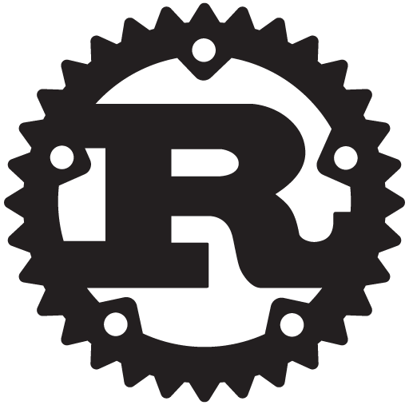
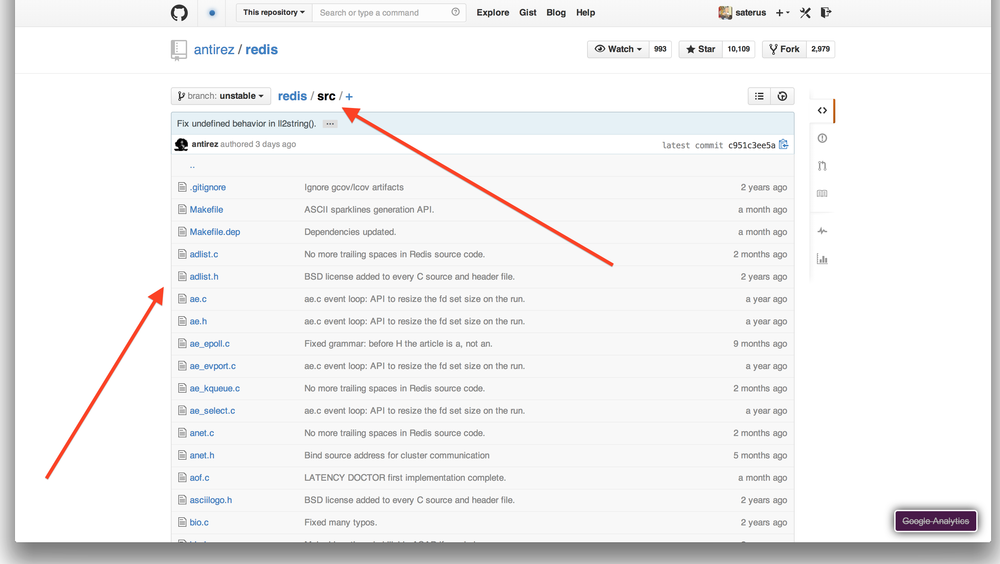

# [fit] Rust
# or: How I Learned to Stop Worrying and Love the Compiler


---

# [fit] Why?
# Learn a New Language?

^
- i mostly use Ruby & friends day to day
- i'll discuss a few of my reasons

---

# *Pure* **Knowledge**

^
- Deliberate Practice
- "Good for you"
- "learn one language per year"
- I like to learn
- Joy of learning. Teaching.


---

## Where is the industry going?

^
- Keeping ahead of the curve.
- We highly value learning on the job, when the knowledge is needed.
- But some things require a foundation.
- Awareness.


---

## The Red Queen's Race

> "Well, in our country," said Alice, still panting a little, "you'd generally get to somewhere else—if you run very fast for a long time, as we've been doing."
  "A slow sort of country!" said the Queen. "Now, here, you see, it takes all the running you can do, to keep in the same place. If you want to get somewhere else, you must run at least twice as fast as that!"
-- Lewis Carroll's Through the Looking-Glass

^
- Money to be made in COBOL.
- Our industry is notorious for moving fast.
- Unless you want to move to management?
- We all believe this is important, as we all came to this talk

---

## *Perspective*


^
- What is your lens?
- Difficult to accurately judge
- Colors or distorts your view of everything

---

## Current Tools: *Stale?*

^
- Look back at what I use today, what are its strengths?
- What are its weaknesses?


---

## Current Tools: *Insufficient?*

^
- What do I sacrifice?
- What *can't* I do?
- What do I take for granted?


---

## New Ideas

^
- What do other people think are strengths?
- What do they gain?


---

## New Opportunity

^
- What *could* we gain?
- New clients?
- Interesting projects?


---



^
- Which brings us to Rust

---

# [fit] Rust =
# *C++* + *Haskell* + *Ruby*


^
- My pitch
- Still alpha, still undergoing heavy dev. big changes.
- Seems like good decisions being made.
- "Rust keeps the C abstract machine model but innovates on the language interface."

---

> "The goal is to design and implement a safe, concurrent, practical, static systems language."
-- Rust Project FAQ

^
- Use recent computer science research.
- Not to a Haskell-level though.
- Ruby's GC was invented in the 60's.
- Learn from some of our mistakes as an industry
- Let's examine some of these goals

---

# [fit] Safe
# Prevent the Preventable

Security Errors

Programmer Induced Instability

^
- buffer overflows
- UndefinedMethodError
- IndexOutOfBoundsError
- null pointer -> crash
- double frees -> crash
- never freed memory -> memory leak -> OOM
- dangling/wild pointers -> unpredictability

---

# [fit] Practical
### ~~**Worse is Better**~~ Better is Good Enough

Explicit > Implicit

Not Built in a Vacuum

Modern High & Low Level Design

^
- Learn from Haskell's mistakes
- explicitly show costs
- c fast: cpu bound
- c is an amazing existing ecosystem
- amazing tools built already
- api design & testing capabilities
- module & package system

---

# [fit] Static
### Catch Errors Early

Provide Safety before Runtime

Eliminate (or isolate) Risky Choices

Optimization

^
- Runtime errors cost more than compile time errors
- Java static straight jacket
- Ruby barely catches syntax errors before runtime
- Most of Rust's safety happens at compile time

---

# [fit] Concurrent
## No Longer an Afterthought

Safe Concurrency Building Blocks

Standard Library Supported

^
- Remember concurrency basics in C?
- Shared mutable state!
- Imagine building a browser. Concurrently. In C++.
- Or Concurrent Garbage Collection?
- Erlang: Fail Fast

---

## Mozilla


**Servo**: experimental browser engine.

- Concurrency
- Parallelism
- Safety
- Reliablity

---


^
- Just passed the Acid 2 test, roughly CSS 2.1.

---


^
- Internet Explorer 6

---


^
- Internet Explorer 7

---


^
- types
- compilation steps
- curly braces
- new concepts!

^
- llvm backend
- bootstrap compilation with rustc

---


^
- unfamiliar places are kind of fun
- kind of exciting

^
- different design choices
- more than programmer happiness: practicality
- maybe this is a different take on happiness...

---

# I/O

```rust
fn main() {
  let hello = "Hello World!";
  println!("{}", hello);

  // => Hello World!

  println!("I/O Works! {}! It's {}!",
           "It's not Haskell",
           2014);

  // => I/O Works! It's not Haskell! It's 2014!
}
```

Compile and Run

```bash
$ rustc hello.rs && ./hello # compile and run program
```

^
- you'll see we have some input/output
- simple string interpolation
- compiled to executable binary
- for now, all we need is a main fn
- we'll revisit this later when we talk about Cargo

---

# Good Defaults

**Immutable** variables:

```rust
let x = 2014u;

x = 0       //  => ERROR
```

Strongly Typed:

```rust
let a = 2014_i64;
let b = 3.14_f64;
let c = "100";

a * b       //  => ERROR
b + c       //  => ERROR
c / a       //  => ERROR
```


^
- immutability: big difference from most languages
- explicit type annotations => sad rubyists
- No implicit type conversions
- Resource Acquisition Is Initialization (1984, Bjarne Stroustrup, 5 years too late!)
- Anyone want to argue about what happens in javascript in this situation?

---

# Functions

```rust
fn add(x: uint, y: uint) -> uint {
  x + y
}

fn main() {
  let a = 100;
  let x = add(a, 1);
  println!("{}", x);
}

// => 101
```


^
- functions require explicitly typed signatures
- "explicit > implicit" design goal
- allows us to do type inference!
- all types resolved at compile time
- expressions
- closer to ruby than c++

---

# Enums

```rust
#[deriving(Show)]
enum Color {
  Red,
  Yellow,
  Green
}

fn main() {
  let stoplight = Red;

  println!("{}", stoplight);
}
```


^
- Playing with numbers alone won't get us far...
- First category of data containers
- Red OR Yellow OR Green
- Algebraic Datatypes!
- C-unions
- Doesn't exist in ruby, we use symbols for this
- Lists, Option, Result

---

# Matching

```rust
impl Color {
  fn new() -> Color {
    Red  // safe default
  }

  fn peek_next(self) -> Color {
    match self {
      Red => Green,
      Yellow => Red,
      Green => Yellow
    }
  }
}

fn main() {
  let stoplight = Color::new();
  let new_stoplight = stoplight.peek_next();
  println!("{} will become {} soon.", stoplight, new_stoplight);
}
```

*Destructure* your Enums, Structs, & Tuples!


^
- destructuring is available for ruby arrays...
- haskell, clojure, others?
- available on enums and structs
- we'll see this come up a lot with Option/Result types
- method impl & call syntax

---

# Tests

```rust
#[test]
fn advances_yellow_to_red() {
  let stoplight = Yellow.peek_next();
  match stoplight {
      Red => true,
      _ => fail!("Yellow stoplights advance to Red!")
  };
}
```

```bash
$ rustc --test color.rs && ./color # compile and run tests
$ rustc color.rs && ./color # compile and run program
```

^
- built in testing
- test business logic, not types or impossible code
- i didn't check for nil, strings, or empty collections!
- compile w/ tests, or without
- idiom is same file
- culture is good, even test code examples by default.

---

# Tests (cont.)

```bash
$ rustc --test color.rs && ./color # compile and run tests
color.rs:9:3: 11:4 warning: code is never used: `new`, #[warn(dead_code)] on by default
color.rs:9   fn new() -> Color {
color.rs:10     Red  // safe default
color.rs:11   }

running 1 test
test advances_yellow_to_red ... ok

test result: ok. 1 passed; 0 failed; 0 ignored; 0 measured
```

^
- dead code lint spots both dead code AND missing test coverage
- two step test: compile? ok! business logic: ok!

---

# Structs

```rust
#[deriving(Show)]
struct Point {
  x: f64,
  y: f64
}

fn main() {
  let origin = Point { x: 0.0, y: 0.0 };

  println!("{}", origin);
}
```


^
- second basic unit of data encapsulation
- list of named fields
- not memory ordered, no crazy pointer arithmetic
- declared at compile time, no crazy @instance == nil default

---

> I call it my billion-dollar mistake. It was the invention of the null reference in 1965.
-- C.A.R. Hoare, Author of Algol W

^
- speaking of ruby's default instance variables...
- rust finally corrects 5 decades of pain
- there's no code to show here
- no null/nil type
- so instead we use option types to represent an empty value

---

# Option Types

```rust
enum Option<T> {   //  exact definition from standard library
  Some(T),
  None
}

fn main() {
  let a: Option<uint> = Some(10);
  let b: Option<uint> = None;
  let c: Option<Color> = Some(Green);
  let d: Option<Color> = None;

  println!("{}, {}, {}, {}", a, b, c, d);

  // => Some(10), None, Some(Green), None

  b == d; // => error: mismatched types... *snip*
}
```

^
- Our first polymorphic type
- "empty value" checked at compile time
- generalize for all types
- composable, define logical functions on Option instead of nullchecks
- 46 std lib fns on Option<T>
- java flashbacks: stabby type signatures... :(

---

# Polymorphic Types (cont.)

```rust
fn main() {
  let vector: Vec<uint> = vec![1, 2, 3, 4, 5];
  let map: HashMap<String, f64> = HashMap::new();

  let possible_value: Option<f64> = map.find("foo");
  match possible_value {
    None => println!("Oh no! That key didn't exist!"),
    Some(value) => println!("Found target {}", value)
  }
}
```

^
- explicit type annotation for clarity
- allow us to build generic data structures
- compile time idea, monomorphization

---

# [fit] Polymorphism
#### (poly = many) + (morph = shape)

Subtyping

Parametric Polymorphism

Ad-hoc Polymorphism

^
- inheritance (runtime)
- generics: works identically for any type
- function overloading (compile time)
- type classes (compile time)
- traits: different behavior, decided by type

---

# [fit] Polymorphism
#### (poly = many) + (morph = shape)

Subtyping = ~~Inheritance~~

Parametric Polymorphism = `Vec<T>`

Ad-hoc Polymorphism = ~~Overloading~~ & Traits

^
- subtyping: complex call heirarchy
- truly favoring composition over inheritance
- generics: well supported
- overloading (not supported)
- traits: define abilities/restrictions
- similar to, but different than Java interfaces


---

# Traits

```rust
trait Area {
  fn area(&self) -> f64;
}

impl Area for Circle {
  fn area(&self) -> f64 {
    self.radius * self.radius * 3.141593
  }
}

fn main() {
  let c = Circle { radius: 10.0, location: Point::origin() };
  let h = Hexagon { side_length: 10.0, location: Point::origin() };
  println!("circle: {}, hexagon: {}", c.area(), h.area());
}
```

^
- trait definition
- trait implementation
- resolution at compile time
- implementation of triangle, square, and hexagon omitted

---

# Trait Bounds

```rust
impl List<T> {
  fn sort<T: PartialOrd>(&self) -> List<T> {
    // exercise for the reader
  }

  fn contains<T: PartialEq>(&self, target: T) -> bool {
    // exercise for the reader
  }
}
```

^
- restrictions/assumptions to rely on
- no, i didn't define the List either
- different restrictions per type

---

# Closures

```rust
fn main() {
  let ten = 10_i64;
  let plus_ten = |value| ten + value;
  let minus_ten = |value: i64| -> i64 {
    value - ten
  };

  let x = 0_i64;
  let y = 1000_i64;

  println!("{} + {} = {}", ten, x, plus_ten(x));
  println!("{} + {} = {}", ten, y, plus_ten(y));

  println!("{} - {} = {}", ten, x, minus_ten(x));
}
```

^
- function objects!
- capture variable scope
- infer types
- build higher order functions in the stdlib
- what? function pointers in c? ha!
- much of the stdlib looks like ruby, taking blocks/closures

---

# Closures (cont.)

```rust
extern crate num;
use num::integer::Integer;

fn main() {
  let nums: Vec<uint> = range(0, 100).collect();

  let squares: Vec<uint> = nums.move_iter()
                               .map(|n| n * n )
                               .filter(|n| n.is_even() )
                               .skip(5)
                               .take(10)
                               .collect();

  println!("squares: {}", squares);
}
```

^
- Iterator provides a lot of closure consuming fns
- very ruby-block like interfaces
- notice the import statement.
- new traits added, numbers learn new tricks.

---

# Modules

```rust
// in project_a/src/traffic/color.rs
mod traffic {
  pub enum Color { ... }
}

// in project_b/src/main.rs
extern crate traffic;
use traffic::Color;     // <-- imported Color enum from `traffic` module

fn main() {
  let stoplight = Red;
  println!("Imported a {} stoplight!", stoplight);
}
```

^
- modules encapsulate data, fns, & traits
- explicit imports of modules & types
- follows familiar ruby file structure

---

# Module File Structure

```bash
$ tree rustc/src/librand
rustc/src/librand
├── distributions                # <-- rand::distributions
│   ├── exponential.rs
│   ├── gamma.rs
│   ├── mod.rs
│   ├── normal.rs                # <-- rand::distributions::normal
│   ├── range.rs
│   └── ziggurat_tables.rs
├── isaac.rs
├── lib.rs                       # <-- rand   (main module defn)
├── rand_impls.rs
└── reseeding.rs                 # <-- rand::reseeding
```

^
- `rand` Crate ships with rust, not re-exported by std.
- map file structure to module structure
- break up modules into appriopriately small pieces
- this is totally what you expect in a web structured gem

---



^
- c convention is to put everything at the top lvl :(
- doublely linked lists are useful in lots of situations
- how do i import the ad_list module alone?

---


# Crates

Unit of Compilation

Single Executable or Library

`rand::*` is merged together before compilation

`extern crate rand` directs us to link to the external `rand` crate

^
- single compiled artifact per crate
- no headers required!
- link and then use!
- importing C libraries is so painful, we all rebuild strings

---

# Cargo Package Manager

Ruby Gems + Bundler

```bash
cargo new
cargo build
cargo test
cargo run
cargo doc
```

`Cargo.toml` & `Cargo.lock` list and lock deps

^
- alpha, built by ex-Bundler team
- modern & opinionated package management
- interesting challenge with compiled binaries
- i've had small problems with bitrot already
- hope to avoid cabal hell

---

# [fit] Rust
## for the
# Advanced Beginner

^
- last time was fun
- today we cover hard stuff
- unique features
- practical stuff

---


^
- follows the explicit & safe goals
- GC isn't explicit, predictable, safe, or easily concurrent

---


^
- memory mgt is a tradeoff
- often dangerous
- very efficient
- realized i don't know much

---


^
- ruby/javascript very opaque.
- when does ruby allocate memory?

---

# Stack & Heap Memory

```rust
fn main() {
  let stack: Color = Red;
  let heap: Box<Color> = box Green;

  println!("stack: {}, heap: {}", stack, heap);

  // end of scope, memory gets freed
}
```

^
- stack? heap? help!
- stack =~ completely local variables
- heap =~ malloc =~ passed between fns
- heap allocations stick around after we `return`

---

# Stack & Heap Memory

```rust
fn main() {
  let stack: Color = Red;

  let heap: Box<Color> = box Green;
  // C: int *ptr = malloc(sizeof(Color));

  println!("stack: {}, heap: {}", stack, heap);

  // end of scope, memory gets freed
 // C: free(heap);
}
```

^
- no manual malloc/free
- mess this up => apocolypse begins
- no garbage collection, compile time!
- heap overflow => attack
- stack overflow => dev error

---

# Ownership

```rust
fn main() {
  let r = box Red;  // allocate some memory

  println!("the value of r: {}", r);  // access value of r

  let color = r;  // transfer ownership

  println!("the value of color: {}", color);  // access value of color

  println!("the value of color: {}", r);  // => error: use of moved value: `r`

  // owner falls out of scope, freeing memory
}
```

^
- key/unique concept in rust
- single owner
- safe memory management
- many other features fall out of this idea

---

# Borrowing

```rust
fn main() {
  let r = box Red;  // allocate some memory

  println!("the value of r: {}", r);  // access value of r

  let color = &r;  // borrow a reference

  println!("the value of color: {}", color);  // access borrowed value

  println!("the value of color: {}", r);  // access owned value

  // owner & borrower fall out of scope
  // owner frees memory
}
```

^
- second reference to the same memory
- immutability makes this safe
- as many immutable borrows as you like

---

# Borrow Checker

```rust
fn main() {
  let x = box 2014u;

  {                       // introduce new scope
    let y = 0i;
    println!("x: {}, y: {}", x, y);
  }                       // y falls out of scope, memory is freed

  println!("{}", x);
}                         // x falls out of scope, memory is freed
```

^
- compiler subsystem
- compiler marks regions of scope
- owner responsible for allocating and freeing
- We can't forget to free our memory. (valgrind)
- borrow checker makes this safe at compile time

---

# Copying

```rust
fn main() {
  let x = Red; // on stack
  let y = x;   // copied!

  println!("{}", x); // => ok
  println!("{}", y); // => ok

  // x frees its copy
  // y frees its copy
}
```

^
- non-boxed values are copied!
- byte for byte copy (memcpy)
- each an owner of its own memory
- shallow copy

---

# Why Ownership on the Heap?

```rust
fn main() {
  let x: Vec<Color> = vec![Red, Green, Red];

  // if we copied...
  let y = x;

  // x frees its vector contents
  // y frees the *same* vector contents
  // double free!
}
```

^
- Vector contents are heap allocated
- shallow copy
- x, stack allocated pointer to that memory
- y is another stack allocated pointer, same memory

---

# Ownership Saves the Day

```rust
fn main() {
  let x: Vec<Color> = vec![Red, Green, Red];

  // the ownership of the contents moves to y
  let y = x;

  println!("{}", y); // => ok

  println!("{}", x); // => error! use of moved value

  // x is already invalidated
  // y frees the vector contents
}
```

^
- compiler spots this, prevents it
- anything non-copy-able is ownership based

---

# Movement & Borrowing

```rust
fn main() {
  let x = box Green;  // x is the owner of memory

  let y = &x;         // y *borrows* x

  println!("{}", x);  // ok!
  println!("{}", y);  // ok! everyone can read immutably borrowed memory!

  let k = x;
  // => error: cannot move out of `x` because it is borrowed

  // y is just a stack allocated pointer
  // x is the owner, so x frees the memory
}
```

^
- ownership can only pass when they own it wholely. no borrows.

---

# Ownership w/ Functions

```rust
fn advance_light(owner: Box<Color>) -> Box<Color> {
  match *owner {
    Red => box Green,
    Yellow => box Red,
    Green => box Yellow
  }
  // `owner` owns the memory. falls out of scope and frees it.
}

fn peek(borrower: &Box<Color>) -> Color {
  match **borrower {
    Red => Green,
    Yellow => Red,
    Green => Yellow
  }
  // `borrower` falls out of scope. nothing happens.
}
```

^
- functions can also take ownership
- the function scope becomes owning scope
- function can pass ownership back to the calling scope
- stack values still passed by value => copied

---

# Ownership w/ Functions

```rust
fn main() {
  let stoplight: Box<Color> = box Green;
  let next_color: Color = peek(&stoplight);

  println!("{} will change to {}", stoplight, next_color);

  let new_light: Box<Color> = advance_light(stoplight);
  println!("Changed to {}", new_light);

  println!("Original Light {}", stoplight);
  // => error: use of moved value: `stoplight`
}
```

^
- pass by value default (copy)
- avoid taking ownership to keep from freeing
- return ownership
- can't return dangling pointers! mem-leaks / segfaults

---

# Mutability

```rust
fn main() {
  let x = box 2014u;
  *x = 0u; // => error: re-assignment of immutable variable `x`

  let mut y = x; // move to mutable ownership
  *y = 0u; // good to go

  let z = y; // move to immutable ownership

  println!("{}", z);
}
```


^
- explicitly marked as such
- mutability is handy
- keep memory as immutable as possible, allow local mutation
- ruby marks *some* methods with ! to indicate mutation

---

# Mutability is Greedy

```rust
fn main() {
  let mut x = box Red;

  {
    let y = &mut x;

    let z = &mut x;
    // => error! cannot borrow `x` as
    //           mutable more than once at a time

    x = box Yellow;
    // => error! cannot assign to `x` because it is borrowed

    *y = box Green; // => ok!
  }

  println!("{}", x); // => Green
}
```

^
- strict rules about actually mutating stuff
- scope/lifetime based. if y falls out of scope...


---

# Mutability w/ Functions

```rust
fn update_position(point: &mut Point, x: f64, y: f64) -> () {
  point.x = x;
  point.y = y;
}

fn reset(point: &mut Point) -> () {
  update_position(point, 0.0, 0.0);
}

fn dup(original: &Point) -> Point {
  Point {
    x: original.x,
    y: original.y
  }
}
```

^
- this is explicit
- mutability encoded in the types!
- staticly checked, no accidental race conditions

---

# Mutability w/ Functions (cont.)

```rust
fn main() {
  let foo: Point = Point { x: 25.0, y: 25.0 };
  reset(&mut foo); // => error! can't take mutable reference of immutable variable

  let mut foo = foo;                    // transfer ownership to mutable scope
  {
      let ref_foo = &foo;               // takes a immutable reference
      let bar = dup(ref_foo);
      println!("Copy: {}", bar);
                                        // immutable ref to foo falls out of scope
  }
  reset(&mut foo);                      // takes a mutable reference

  println!("New Position: {}", foo);
}
```

^
- mutability is a little bit of a hassle.
- that's a Good Thing
- mutable references are exclusive
- error: cannot borrow `foo` as mutable because it is also borrowed as immutable

---

# Strings

```rust
use std::ascii::StrAsciiExt;

fn main() {
  let polite = "Hello";
  let rude = polite.to_ascii_upper();

  println!("{} is polite.", polite);
  println!("{} is rude.", rude);
}
```

^
- That took a while to get here...
- Ruby doesn't care, it copies
- Rust is very careful with strings
- valid utf8 seq
- Follows mutability rules
- StrAsciiExt trait adds methods

---

# String Slices

```rust
use std::ascii::StrAsciiExt;

fn main() {
  let polite: &'static str = "Hello";   // string slice
  let rude: String = polite.to_ascii_upper(); // string

  println!("{} is polite.", polite);
  println!("{} is rude.", rude);
}
```

^
- Two types
- 'static is a lifetime
- str is the primative string type
- Strings are allocated


---

# Slices

```rust
fn main() {
  let vector: Vec<uint> = vec![1, 2, 3];
  let v_slice: &[uint] = vector.as_slice();

  println!("{} and {} are the same *exact* data!",
           vector, v_slice);

  for i in v_slice.iter() {
    println!("{} from slice!", i);
  }
}
```

^
- 29 "as_slice()" methods
- free operations, pointer
- views into existing data
- borrow checker ensures this is always valid & safe
- many useful operations on slices, iterator

---

# Iterators

```rust
let mut r = range(0u, 10);
loop  {
  match r.next() {      // => Iterator::next() returns an Option
    None => break,
    Some(n) => {
      println!("n: {}" , n);
    }
  }
}

for n in range(0u, 10) {
  println!("n: {}" , n);
}
```

^
- syntactic sugar
- loop is while(true) w/ compiler hints
- for calls .next() on iterators
- completely equivalent

---

# Composable Iterators

```rust
fn main() {
  let seq: [Color, ..3] = [Green, Yellow, Red];
  let timing: Vec<uint> = vec![20u, 4u, 10u];

  let mut stoplight = seq.iter().zip(timing.iter()).cycle();

  for (color, time) in stoplight {
    println!("{} for {}s", color, time);
  }
}
```

^
- very flexible, composable
- specifically different than the underlying container
- iterators must be mutable

---

# Iterators of Many Flavors

```rust
use std::collections::HashMap;
use std::collections::PriorityQueue;

fn main() {
  let mut map: HashMap<String, u8> = HashMap::new();
  let mut queue: PriorityQueue<u8> = PriorityQueue::new();

  for n in range(0u, 10) {
    map.insert(n.to_string(), std::rand::random());
    queue.push(std::rand::random());
  }

  for (k,v) in map.iter() { println!("Map Item: {} => {}", k, v) }
  for i in queue.iter() { println!("Queue Item: {}", i) }
}
```

^
- very different structures
- expected unordered hash traversal
- expected priority-order queue traversal

---

# Iterator Traversal

```bash
$ rustc iterator_flavors.rs && ./iterator_flavors
Map Item: 7 => 247
Map Item: 9 => 235
Map Item: 2 => 52
Map Item: 0 => 117
Map Item: 1 => 66
Map Item: 8 => 191
Map Item: 4 => 60
Map Item: 3 => 133
Map Item: 5 => 220
Map Item: 6 => 89
Queue Item: 225
Queue Item: 218
Queue Item: 198
Queue Item: 184
Queue Item: 46
Queue Item: 4
Queue Item: 33
Queue Item: 17
Queue Item: 83
Queue Item: 44
```


^
- reasonable explanation?
- someone even documented this behavior
- it should at least provide a priority_iter()
- turns out not *everything* is caught at compile time
- you can collect it into a sorted vector

---

# Common Traits

- `std::ops::*`
- `Show: to_string()`
- `Eq: ==`
- `PartialEq: eq(), ne()`
- `Equiv: equiv()`
- `Ord: cmp()`
- `PartialOrd: >=, <=, >, <`
- `Num, One, Zero, Float, Integer`
- `Deref: unary *`


^
- many, many std lib traits
- many of these are on most built-ins
- used to implement operators
- std::ops
- properties to rely on
- deref works on custom wrappers

---

# Kinds

- `Copy`: memcpy friendly `.clone()`
- `Sized`: compile-time sized
- `Sync`: threadsafe
- `Send`: cross task boundary


^
- used by compiler to enforce rules
- marker traits
- cross task boundary? 

---

# Tasks

```rust
fn main() {
  let (tx, rx) = channel();

  spawn(proc() {
    tx.send("Data produced in child task");
  });

  let data = rx.recv();
  println!("{}", data);
  // 1x => Data produced in child task
}
```

^
- rust concurrency is in libs, not the language
- relies on safe memory ownership guarantees
- transmit/receive, telecom
- channels are aync 1-way communication
- proc is a special closure

---

# Procs

```rust
fn main() {
  let (tx, rx) = channel();

  for task_num in range(0u, 10) {
    let tx = tx.clone();  // => must copy transmitter before sending
    spawn(proc() {
      tx.send("Data produced in child task");
    });
  }

  for _ in range(0u, 10) {
    let data = rx.recv();
    println!("{}", data);
  }
  // 10x => Data produced in child task
}
```

^
- special closures
- procs own their memory
- ie. ownership is moved
- common answer is clone()
- many tx, one rx

---

# Big Data Syncs!

```rust
use std::sync::Arc;       // => foreshadowing...

#[deriving(Show)]
struct HugeStruct {
  huge_name: String
}

impl HugeStruct {
  fn new() -> HugeStruct {
    HugeStruct { huge_name: "I'M HUGE".to_string() }
  }
}
```

^
- but if we copy everything we want to share...
- pushing the limits of code slides
- i want a way to avoid needlessly copying large objects
- this is very, very handy

---

# Shared Immutable Memory

```rust
fn main() {
  let (tx, rx) = channel();
  let huge_struct = Arc::new(HugeStruct::new());

  for task_num in range(0u, 10) {
    let tx = tx.clone();
    let huge_struct = huge_struct.clone();
    spawn(proc() {
      let msg = format!("Task {}: Accessed {}", task_num, huge_struct.huge_name);
      tx.send(msg);
    });
  }
  drop(tx); // => force last transmitter to hang up

  for data in rx.iter() {
    println!("{}", data); // 10x => Task N: Accessed I'M HUGE
  }
}
```

^
- atomic read/write access
- cloning Arcs is cheap
- increment internal counter
- interesting: auto-deref
- locking, less than ideal
- Rc for non-atomic ops

---

# JSON Serialization

```rust
extern crate serialize;
use serialize::json::{Json, ToJson, Object};
use std::collections::TreeMap;

#[deriving(Show)]
struct User {
  id: u64,
  name: String,
  friends: Vec<u64>
}

```

^
- how does a static language do json?
- enums!

---

# ToJson

```rust
impl ToJson for User {
  fn to_json(&self) -> Json {
    let mut map = TreeMap::new();
    map.insert("id".to_string(), self.id.to_json());
    map.insert("name".to_string(), self.name.to_json());
    map.insert("friends".to_string(), self.friends.to_json());
    Object(map)   // => enum value for Json type
  }
}
```

---

# Json Output

```rust
fn main() {
  let brenda = User {
    id: 1,
    name: "BrendaTheSuccessfulDieter".to_string(),
    friends: vec![4,47,92]
  };

  println!("brenda.show(): \n{}\n", brenda);
  println!("brenda.to_json(): \n{}", brenda.to_json());
}
```

```
~ rustc verbose_json.rs && ./verbose_json
brenda.show():
User { id: 1, name: BrendaTheSuccessfulDieter, friends: [4, 47, 92] }

brenda.to_json():
{"friends":[4,47,92],"id":1,"name":"BrendaTheSuccessfulDieter"}
```

---

# Json Deriving!

```rust
extern crate serialize;
use serialize::json;

#[deriving(Show,Encodable)]
struct User {
  id: u64,
  name: String,
  friends: Vec<u64>
}

fn main() {
  let brenda = User {
    id: 1,
    name: "BrendaTheSuccessfulDieter".to_string(),
    friends: vec![4,47,92]
  };

  println!("brenda.show(): \n{}\n", brenda);
  println!("brenda.to_json(): \n{}", json::encode(&brenda));
}
```

---

# Decoding Json

```rust
#[deriving(Show,Encodable,Decodable)]
struct User {
*snip*
```
# Completely ran out of time last night...

---

# Official Documentation

- http://www.rust-lang.org
- http://doc.rust-lang.org
- http://doc.rust-lang.org/std/
- cargo doc
- Dash! (stable versions)

---

# Unofficial Documentation

- http://rustbyexample.com/
- http://www.rustforrubyists.com/
- https://aturon.github.io/

---


^
- interactive
- nice for short tests
- integration with irc room

---


^
- rustc & servo
- cargo
- iron
- nes emulator

---

Attributions

rust_belt_reflection.jpg https://secure.flickr.com/photos/bobjagendorf/4096384506/
rusted_tools.jpg https://secure.flickr.com/photos/risager/3820277139/
clean_wrench.jpg https://secure.flickr.com/photos/kefraya/4739568104
plane.jpg https://secure.flickr.com/photos/smallape/9517017036
diverse_tools.jpg https://secure.flickr.com/photos/the_justified_sinner/9615231449
library.jpg https://secure.flickr.com/photos/andryn2006/8273318896/
tracks.jpg https://secure.flickr.com/photos/chilledsalad/2826140112
open_gate.jpg https://secure.flickr.com/photos/hamedmasoumi/670209311
rusted_cpp.jpg https://secure.flickr.com/photos/lance_mountain/5510623923
rust-logo.png https://github.com/rust-lang/rust-www
firefox.png https://assets.mozilla.org/Brands-Logos/Firefox/logo-only/firefox_logo-only_RGB.png
danger.jpg https://secure.flickr.com/photos/spcbrass/4557822128/
unfamiliar.jpg https://secure.flickr.com/photos/sinkdd/6231006404/
lens.jpg https://secure.flickr.com/photos/48282656@N00/6278792579/
bored.jpg https://secure.flickr.com/photos/edsuom/12000214186/
safety_first.jpg https://secure.flickr.com/photos/dystopos/29166422/
numbers.jpg https://secure.flickr.com/photos/jalevega/8733967750
adding_machine.jpg https://secure.flickr.com/photos/nanpalmero/12889833305
stoplight.jpg https://secure.flickr.com/photos/sharynmorrow/2091282725
struct.jpg https://secure.flickr.com/photos/vonderauvisuals/7464724802/
struct2.jpg https://secure.flickr.com/photos/zigazou76/7670875192/
green_stoplight.jpg https://secure.flickr.com/photos/jstanphoto/4744085931/
ie6_acid2.png "Ieacid2" by Acid2 Task Force - https://commons.wikimedia.org/wiki/File:Ieacid2.png#mediaviewer/File:Ieacid2.png
i67_acid2.png "Ie7acid2" by Acid2 Task Force - https://commons.wikimedia.org/wiki/File:Ie7acid2.png#mediaviewer/File:Ie7acid2.png
memory2.jpg https://secure.flickr.com/photos/jurvetson/1130981
ram2.jpg https://secure.flickr.com/photos/isherwoodchris/6917253693/
brain.png https://secure.flickr.com/photos/125992663@N02/14597738221
schematic.jpg https://secure.flickr.com/photos/zdepth/8227198392/
